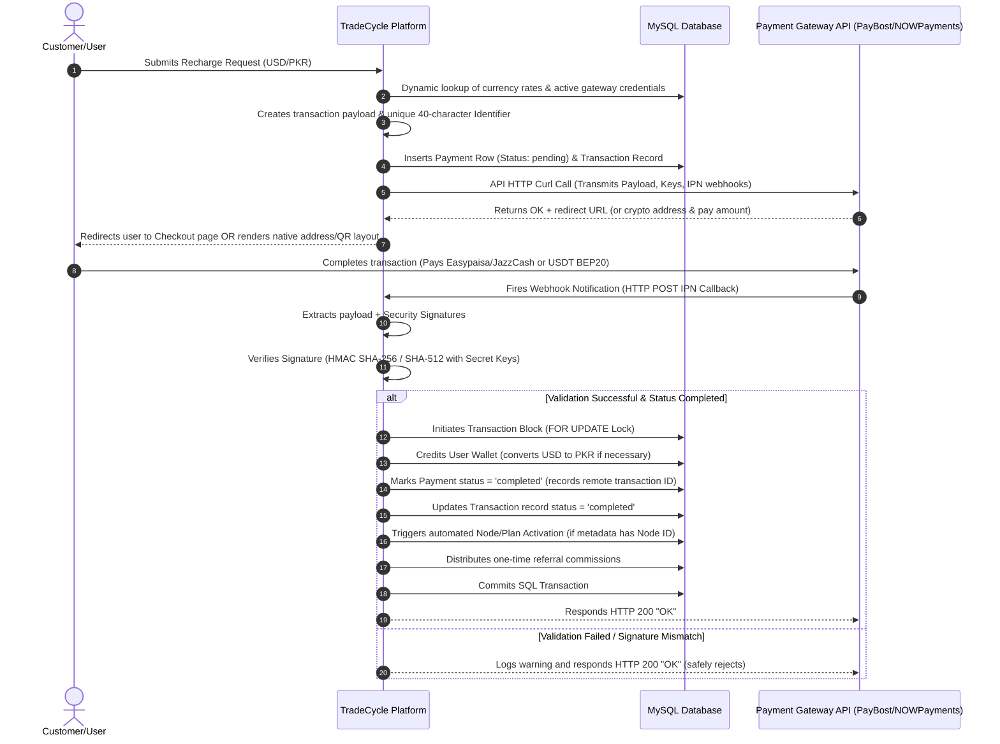

# TradeCycle Payment Gateways Integration & API Documentation
> [!IMPORTANT]
> This is a production-level integration guide detailing the exact architecture, database structures, payloads, authentication signatures, and processing webhooks (IPNs) for all payment gateways implemented in the **TradeCycle** platform. It contains real payload keys, configuration overrides, database schemas, and drop-in gateway classes so that this documentation can be handed off directly to another developer or integrated into a new system.

---

## 1. Architectural Design & Payment Flow
TradeCycle employs a high-security, automated payment architecture designed around **Gateway Wrappers**, **Atomic SQL Transactions**, **Double-Spend Verification**, and **Instant Webhook Reconciliation**.

### System Architecture Flowchart


---

## 2. Database Schema (MySQL DDL Setup)
To implement this payment system in any PHP-based project, set up the following database tables. They preserve transactional logs, configuration settings, user wallet balances, and historical ledgers.

### 2.1. Payment Gateways Configurations (`payment_gateways`)
Stores settings, activation status, fees, and API credentials for each specific payment channel.
```sql
CREATE TABLE IF NOT EXISTS `payment_gateways` (
  `id` INT(11) NOT NULL AUTO_INCREMENT,
  `name` VARCHAR(100) NOT NULL,
  `slug` VARCHAR(50) NOT NULL UNIQUE,
  `type` ENUM('automatic', 'manual') NOT NULL DEFAULT 'automatic',
  `min_deposit` DECIMAL(15,2) NOT NULL DEFAULT 0.00,
  `max_deposit` DECIMAL(15,2) NOT NULL DEFAULT 0.00,
  `min_withdrawal` DECIMAL(15,2) NOT NULL DEFAULT 0.00,
  `max_withdrawal` DECIMAL(15,2) NOT NULL DEFAULT 0.00,
  `fee_deposit_pct` DECIMAL(5,2) NOT NULL DEFAULT 0.00,
  `fee_withdraw_pct` DECIMAL(5,2) NOT NULL DEFAULT 0.00,
  `api_key` VARCHAR(255) DEFAULT NULL,
  `api_secret` VARCHAR(255) DEFAULT NULL,
  `api_merchant_id` VARCHAR(255) DEFAULT NULL COMMENT 'Used as Wallet Address or Public Key',
  `api_endpoint` VARCHAR(255) DEFAULT NULL,
  `instructions` TEXT DEFAULT NULL,
  `is_deposit` TINYINT(1) NOT NULL DEFAULT 1,
  `is_withdrawal` TINYINT(1) NOT NULL DEFAULT 0,
  `is_active` TINYINT(1) NOT NULL DEFAULT 1,
  `sort_order` INT(11) NOT NULL DEFAULT 0,
  `created_at` DATETIME DEFAULT CURRENT_TIMESTAMP,
  `updated_at` DATETIME DEFAULT CURRENT_TIMESTAMP ON UPDATE CURRENT_TIMESTAMP,
  PRIMARY KEY (`id`)
) ENGINE=InnoDB DEFAULT CHARSET=utf8mb4 COLLATE=utf8mb4_general_ci;
```

### 2.2. Transactions Ledger Table (`transactions`)
Records user ledger movements (deposits, investments, bonuses, payouts).
```sql
CREATE TABLE IF NOT EXISTS `transactions` (
  `id` INT(11) NOT NULL AUTO_INCREMENT,
  `user_id` INT(11) NOT NULL,
  `type` VARCHAR(30) NOT NULL COMMENT 'deposit, investment, referral_bonus, pool_bonus, withdrawal',
  `amount` DECIMAL(15,2) NOT NULL,
  `reference_id` INT(11) DEFAULT NULL COMMENT 'References payments.id or user_investments.id',
  `gateway` VARCHAR(50) DEFAULT NULL,
  `txn_id` VARCHAR(100) DEFAULT NULL COMMENT 'Remote transaction ID from provider',
  `status` VARCHAR(20) NOT NULL DEFAULT 'pending' COMMENT 'pending, completed, rejected',
  `note` TEXT DEFAULT NULL,
  `created_at` DATETIME DEFAULT CURRENT_TIMESTAMP,
  PRIMARY KEY (`id`),
  KEY `idx_user_id` (`user_id`),
  KEY `idx_status` (`status`)
) ENGINE=InnoDB DEFAULT CHARSET=utf8mb4 COLLATE=utf8mb4_general_ci;
```

### 2.3. Payments Tracker Table (`payments`)
Tracks discrete checkout sessions generated by users, along with request payloads and webhook logs.
```sql
CREATE TABLE IF NOT EXISTS `payments` (
  `id` INT(11) NOT NULL AUTO_INCREMENT,
  `user_id` INT(11) NOT NULL,
  `order_id` VARCHAR(100) NOT NULL,
  `identifier` VARCHAR(100) NOT NULL UNIQUE COMMENT 'Unique 20-40 char checkout reference',
  `gateway_slug` VARCHAR(50) NOT NULL,
  `amount` DECIMAL(15,2) NOT NULL COMMENT 'Invoice base amount',
  `currency` VARCHAR(10) NOT NULL DEFAULT 'USD',
  `charges` DECIMAL(15,2) NOT NULL DEFAULT 0.00,
  `transaction_id` VARCHAR(100) DEFAULT NULL COMMENT 'Remote payment gateway ID',
  `status` VARCHAR(20) NOT NULL DEFAULT 'pending' COMMENT 'pending, completed, cancelled',
  `payment_url` TEXT DEFAULT NULL,
  `gateway_message` VARCHAR(255) DEFAULT NULL,
  `gateway_response` TEXT DEFAULT NULL COMMENT 'Raw callback JSON payload',
  `request_payload` TEXT DEFAULT NULL COMMENT 'Raw request initialization JSON payload',
  `metadata` TEXT DEFAULT NULL COMMENT 'JSON storage of node_id, is_upgrade, is_trial, etc.',
  `credited_at` DATETIME DEFAULT NULL COMMENT 'Double-spend safety gate',
  `created_at` DATETIME NOT NULL,
  `updated_at` DATETIME NOT NULL,
  PRIMARY KEY (`id`),
  KEY `idx_identifier` (`identifier`),
  KEY `idx_order_id` (`order_id`)
) ENGINE=InnoDB DEFAULT CHARSET=utf8mb4 COLLATE=utf8mb4_general_ci;
```

### 2.4. User Wallet Table (`wallet`)
Tracks liquid funds.
```sql
CREATE TABLE IF NOT EXISTS `wallet` (
  `id` INT(11) NOT NULL AUTO_INCREMENT,
  `user_id` INT(11) NOT NULL UNIQUE,
  `balance` DECIMAL(15,2) NOT NULL DEFAULT 0.00 COMMENT 'Stored in PKR (PKR is platform main currency)',
  `earning_balance` DECIMAL(15,2) NOT NULL DEFAULT 0.00,
  `total_earned` DECIMAL(15,2) NOT NULL DEFAULT 0.00,
  `total_withdrawn` DECIMAL(15,2) NOT NULL DEFAULT 0.00,
  PRIMARY KEY (`id`),
  CONSTRAINT `fk_wallet_user` FOREIGN KEY (`user_id`) REFERENCES `users` (`id`) ON DELETE CASCADE
) ENGINE=InnoDB DEFAULT CHARSET=utf8mb4 COLLATE=utf8mb4_general_ci;
```

---

## 3. Global Settings & File-Based Fallbacks
The system handles settings in two places. Hardcoded defaults reside in `config/payment_credentials.php`, while database overrides are managed from the admin panel (`site_settings` table).

### 3.1. Database Runtime Settings (`site_settings`)
Admin settings used by payment processors:
*   `currency_mode` (values: `pkr` or `usdt`). If set to `usdt`, all prices entered on the site are treated as USD and converted to PKR for wallets.
*   `usdt_pkr_rate` (e.g. `290`). Conversion rate multiplied to the USD deposit amount to credit PKR.
*   `deposit_fee_pct` (global additional deposit fee percentage).
*   `gateway_env_paybost` (values: `sandbox` or `live`).
*   `gateway_env_nowpayments` (values: `sandbox` or `live`).

### 3.2. Server-Side Credentials Map (`config/payment_credentials.php`)
This file is kept in the server directory and excluded from git repositories to secure live secrets:
```php
<?php
// config/payment_credentials.php - Server-side secure overrides
return [
    'paybost' => [
        'active_environment' => 'live',
        'sandbox_endpoint' => 'https://paybost.com/sandbox/payment/initiate',
        'live_endpoint' => 'https://paybost.com/payment/initiate',
        'ssl_verify_peer' => true,
        'ssl_verify_host' => 2,
        'identifier_prefix' => 'TCPB',
        'gateways' => [
            'easypaisa_payboost' => [
                'label' => 'Easypaisa (PayBost)',
                'api_key' => 'el7m4kt3kq44xuyfk8lz78eggt1ze5vxpe9mpivvm1tjhfa7k1',
                'secret_key' => 'wbjvqx9gnvbdqhs3t37c3ymhle857mdnl0x3xmy0tyt2xgxu7m',
            ],
            'jazzcash_payboost' => [
                'label' => 'JazzCash (PayBost)',
                'api_key' => 'el7m4kt3kq44xuyfk8lz78eggt1ze5vxpe9mpivvm1tjhfa7k1',
                'secret_key' => 'wbjvqx9gnvbdqhs3t37c3ymhle857mdnl0x3xmy0tyt2xgxu7m',
            ],
        ],
    ],
    'nowpayments' => [
        'active_environment' => 'live',
        'base_url' => 'https://api.nowpayments.io/v1',
        'ssl_verify_peer' => true,
        'ssl_verify_host' => 2,
        'identifier_prefix' => 'TCNP',
        'gateways' => [
            'nowpayments_bep20' => [
                'label' => 'NOWPayments (USDT BEP20)',
                'api_key' => '0D77JXB-3ZK487W-GC97DAB-MWCP9EP',
                'ipn_secret' => 'h7JD95Tg8T6q5g6TPh3GMF1rbI4ACQZt',
                'public_key' => 'afdd76ba-26d6-4e0f-9e94-ba92cf8dffc2',
                'pay_currency' => 'usdtbsc',
                'price_currency' => 'usd',
            ],
        ],
    ],
];
```

---

## 4. Gateway Integration: PayBost (Local PKR Wallets)
**PayBost** serves local Pakistani mobile wallet gateways (Easypaisa and JazzCash) automatically without manual screenshot proof validation.

### 4.1. Base Endpoints
*   **Sandbox Mode**: `https://paybost.com/sandbox/payment/initiate`
*   **Production Mode**: `https://paybost.com/payment/initiate`

### 4.2. API Parameters List (Request Payload)
Sent to the gateway endpoints via an `application/x-www-form-urlencoded` HTTP POST request:

| Key | Format | Example | Description |
| :--- | :--- | :--- | :--- |
| `identifier` | String | `TCPB260519134316A3F9` | Generated transaction tracking reference (Max 20 chars). |
| `currency` | String | `PKR` | Base payment fiat currency. Always `PKR` for Pakistani gateways. |
| `amount` | Decimal | `15000.00` | The total payable amount (PKR). |
| `public_key` | String | `el7m4kt3kq44xuyfk8...` | API Key provided by PayBost. |
| `payment_type` | String | `easypaisa` / `jazzcash` | The targeted wallet processing protocol. |
| `ipn_url` | String (URL) | `https://tradecycle.live/pages/wallet/ipn_paybost.php` | The platform callback API listening for IPN webhook posts. |
| `success_url` | String (URL) | `https://tradecycle.live/pages/wallet/payment-success.php` | User redirect URL upon successful checkout transaction. |
| `cancel_url` | String (URL) | `https://tradecycle.live/pages/wallet/payment-cancel.php` | User redirect URL upon manual transaction abort. |
| `customer_name`| String | `Salman Noor` | The full name of the platform user. |
| `customer_email`| String | `salman@email.com` | User email address. Defaults to `{phone}@tradecycle.live` if missing. |
| `details` | String | `Trade Cycle - Deposit` | Transaction details description. |
| `checkout_theme`| String | `dark` | Visual theme rendering control (`light` or `dark`). |
| `site_logo` | String (URL) | `https://tradecycle.live/assets/logo.png` | Platform logo printed on invoice pages. |
| `merchant` | String | `Trade Cycle` | Custom merchant branding identity label. |

### 4.3. Gateway API Response Shape
Upon success, PayBost returns a JSON document containing the checkout checkout link:
```json
{
  "success": "ok",
  "url": "https://paybost.com/payment/checkout/abc123xyz456...",
  "message": "Payment url generated successfully.",
  "http_code": 200
}
```

### 4.4. Webhook IPN Callback & Security Signature Logic
When payment is complete, PayBost fires an asynchronous background `POST` request to `ipn_url`.

#### Webhook Input Payload:
```json
{
  "status": "success",
  "identifier": "TCPB260519134316A3F9",
  "signature": "3F9D1E8C224B8B9B7E9F90C1D02E4F6A5B8C7E6D5F9A8B7C6E5D4F3A2B1C0D9E",
  "data": {
    "amount": "15000.00",
    "charges": "0.00",
    "transaction_id": "31415926535"
  }
}
```

#### HMAC SHA-256 Signature Math:
To authenticate that the webhook comes from PayBost, reconstruct the signature string and run it through a secure comparison:
1. Concatenate the standard decimal amount format (with 2 decimal places) with the checkout identifier:
   $$\text{customKey} = \text{amount} + \text{identifier}$$
   *Example:* `"15000.00" + "TCPB260519134316A3F9"` $\rightarrow$ `"15000.00TCPB260519134316A3F9"`
2. Compute the HMAC-SHA256 signature using the configured PayBost Gateway **Secret Key** as the cryptographic salt, and uppercase it:
   $$\text{Expected Signature} = \text{UPPERCASE}(\text{HMAC-SHA256}(\text{customKey}, \text{SecretKey}))$$

> [!WARNING]
> **Float Formatting Webhook Bug Prevention:**
> Since various programming languages, servers, or libraries format floating-point amounts differently (e.g., `15000`, `15000.0`, `15000.00`), computing the signature on a mismatched format will cause valid webhooks to fail.
> 
> To prevent lost payments, TradeCycle computes **5 Candidate Float Formats** and tries to match the signature against each candidate:
> 1. `number_format($amount, 2, '.', '')` (e.g. `15000.00`)
> 2. `number_format($amount, 1, '.', '')` (e.g. `15000.0`)
> 3. `number_format($amount, 0, '.', '')` (e.g. `15000`)
> 4. `rtrim(rtrim(number_format($amount, 8, '.', ''), '0'), '.')` (Strips trailing decimals)
> 5. `(string)$amount` (Raw input typecast string)
> 
> If the received signature matches **any** of the generated candidate hashes, the transaction is verified.

---

## 5. Gateway Integration: NOWPayments (USDT BEP20 Crypto)
**NOWPayments** manages automatic blockchain deposits. Specifically, USDT BEP20 token payments over the Binance Smart Chain (BSC) network.

### 5.1. Base API Endpoints
*   **Base URL**: `https://api.nowpayments.io/v1`
*   **Initiate Payment**: `/payment` (POST)
*   **Fetch Payment Status**: `/payment/{payment_id}` (GET)
*   **Create Payout**: `/payout` (POST)

### 5.2. HTTP Header Credentials
All API curl calls to NOWPayments require these HTTP Headers:
```http
Content-Type: application/json
x-api-key: 0D77JXB-3ZK487W-GC97DAB-MWCP9EP
```

### 5.3. Payment Initiation Request (Payload JSON)
Sent as a raw `POST` JSON body to `https://api.nowpayments.io/v1/payment`:
```json
{
  "price_amount": 51.72,
  "price_currency": "usd",
  "pay_currency": "usdtbsc",
  "order_id": "TCNP260519134316F9E2",
  "ipn_callback_url": "https://tradecycle.live/pages/wallet/ipn_nowpayments.php",
  "success_url": "https://tradecycle.live/pages/wallet/payment-success.php?identifier=TCNP260519134316F9E2",
  "cancel_url": "https://tradecycle.live/pages/wallet/payment-cancel.php?identifier=TCNP260519134316F9E2"
}
```

### 5.4. Payment Initiation Response (Payload JSON)
NOWPayments returns transaction details along with a unique customer deposit wallet address:
```json
{
  "payment_id": "6328905147",
  "payment_status": "waiting",
  "pay_address": "0x3f5ce5fbfe8b9c8b0b8c4d2d6d8f8a...",
  "price_amount": 51.72,
  "price_currency": "usd",
  "pay_amount": 51.723841,
  "pay_currency": "usdtbsc",
  "order_id": "TCNP260519134316F9E2",
  "invoice_url": "https://nowpayments.io/payment?iid=6328905147",
  "created_at": "2026-05-19T13:43:20.123Z",
  "updated_at": "2026-05-19T13:43:20.123Z"
}
```
*Note: The platform extracts `pay_address` and `pay_amount` from this response and displays them directly to the customer on a custom page along with a dynamically generated payment QR code, bypassing the default hosted checkout page.*

### 5.5. Webhook IPN Callback & HMAC SHA-512 Security Signature
Upon wallet receipt detection, NOWPayments POSTs the transaction webhook to `ipn_callback_url`.

#### Verification Header:
NOWPayments transmits the security signature in the HTTP header value:
`HTTP_X_NOWPAYMENTS_SIG` (Retrieved via `$_SERVER['HTTP_X_NOWPAYMENTS_SIG']`)

#### Webhook Input Payload:
```json
{
  "payment_id": 6328905147,
  "invoice_id": 5589104,
  "payment_status": "finished",
  "pay_address": "0x3f5ce5fbfe8b9c8b0b8c4d2d6d8f8a...",
  "price_amount": 51.72,
  "price_currency": "usd",
  "actual_amount": 51.723841,
  "actually_paid": 51.723841,
  "pay_amount": 51.723841,
  "pay_currency": "usdtbsc",
  "order_id": "TCNP260519134316F9E2",
  "purchase_id": "8901247",
  "created_at": "2026-05-19T13:43:20.000Z",
  "updated_at": "2026-05-19T13:45:10.000Z"
}
```

#### HMAC SHA-512 Signature Mathematics:
To verify the payload's integrity, check the raw request body string against the signature header:
1. Re-read the raw incoming POST body data:
   $$\text{rawBody} = \text{file\_get\_contents}('php://input')$$
2. Compute the HMAC-SHA512 hash using the raw JSON body and the gateway's **IPN Secret** key:
   $$\text{Expected Signature} = \text{HMAC-SHA512}(\text{rawBody}, \text{ipnSecret})$$
3. Validate securely using a constant-time comparison to prevent timing attacks:
   $$\text{isValid} = \text{hash\_equals}(\text{Expected Signature}, \text{Received Signature})$$

> [!IMPORTANT]
> **Actionable Webhook States:**
> A payment should **only** credit a user's wallet when the `payment_status` is explicitly flagged as `'finished'` or `'confirmed'`. All other state updates (`waiting`, `confirming`, `sending`, `failed`, `expired`) should only update logs or UI screens and must **never** trigger balance adjustments.

---

## 6. Auto-Plan (Node) Activation Logic
TradeCycle links payments and user investments. 

When a user initiates a recharge to purchase a plan, details like `node_id`, `is_upgrade`, and `is_trial` are serialized in the `metadata` column of the `payments` table.

Once the Webhook verifies the signature and credits the user's wallet, `hk_credit_payment()` automatically calls `hk_activate_node_logic()`. This deducts the wallet balance, activates the package, and writes the investment record in a single transaction block.

```php
// Extract from payments processing:
$metadata = !empty($payment['metadata']) ? json_decode($payment['metadata'], true) : [];
if (!empty($metadata['node_id']) || !empty($metadata['is_trial'])) {
    hk_activate_node_logic($pdo, [
        'user_id'      => $payment['user_id'],
        'node_id'      => (int)($metadata['node_id'] ?? 0),
        'amount'       => (float)$payment['amount'], 
        'is_upgrade'   => (int)($metadata['is_upgrade'] ?? 0),
        'is_trial'     => (int)($metadata['is_trial'] ?? 0),
        'currency'     => $payment['currency'],
        'payment_type' => 'wallet'
    ]);
}
```

---

## 7. Drop-In Code Templates (PHP Wrapper Library)
The following verified PHP classes can be added directly to your application to handle PayBost and NOWPayments transactions.

### 7.1. Gateway Interface (`gateways/GatewayInterface.php`)
```php
<?php
// gateways/GatewayInterface.php

interface GatewayInterface {
    public function initiatePayment($data);
    public function validatePayment($data);
}
```

### 7.2. NOWPayments Class Wrapper (`gateways/NowPaymentsGateway.php`)
```php
<?php
// gateways/NowPaymentsGateway.php

require_once 'GatewayInterface.php';

class NowPaymentsGateway implements GatewayInterface {
    protected $apiKey;
    protected $ipnSecret;
    protected $apiUrl = "https://api.nowpayments.io/v1";
    protected $sslVerifyPeer = true;
    protected $sslVerifyHost = 2;

    public function __construct($apiKey, $ipnSecret = null, array $options = []) {
        $this->apiKey = $apiKey;
        $this->ipnSecret = $ipnSecret;
        $this->apiUrl = $options['base_url'] ?? $this->apiUrl;
        $this->sslVerifyPeer = (bool)($options['ssl_verify_peer'] ?? true);
        $this->sslVerifyHost = (int)($options['ssl_verify_host'] ?? 2);
    }

    public function initiatePayment($data) {
        $endpoint = $this->apiUrl . "/payment";
        
        $payload = [
            "price_amount"     => $data['amount'],
            "price_currency"   => $data['currency'] ?? "usd",
            "pay_currency"     => $data['pay_currency'] ?? "usdtbsc",
            "order_id"         => $data['identifier'],
            "ipn_callback_url" => $data['ipn_url'],
            "success_url"      => $data['success_url'],
            "cancel_url"       => $data['cancel_url'],
        ];

        $ch = curl_init($endpoint);
        curl_setopt($ch, CURLOPT_RETURNTRANSFER, true);
        curl_setopt($ch, CURLOPT_POST, true);
        curl_setopt($ch, CURLOPT_POSTFIELDS, json_encode($payload));
        curl_setopt($ch, CURLOPT_TIMEOUT, 45);
        curl_setopt($ch, CURLOPT_CONNECTTIMEOUT, 15);
        curl_setopt($ch, CURLOPT_SSL_VERIFYHOST, $this->sslVerifyHost);
        curl_setopt($ch, CURLOPT_SSL_VERIFYPEER, $this->sslVerifyPeer);
        curl_setopt($ch, CURLOPT_HTTPHEADER, [
            'Content-Type: application/json',
            'x-api-key: ' . $this->apiKey
        ]);
        
        $result = curl_exec($ch);
        $curlError = curl_error($ch);
        $httpCode = (int)curl_getinfo($ch, CURLINFO_HTTP_CODE);
        curl_close($ch);

        if ($result === false) {
            return [
                'message' => $curlError ?: 'Unable to connect to NOWPayments.',
                'http_code' => $httpCode,
            ];
        }

        $decoded = json_decode($result, true);
        if (!is_array($decoded)) {
            return [
                'message' => 'Invalid NOWPayments response.',
                'raw' => $result,
                'http_code' => $httpCode,
            ];
        }

        $decoded['http_code'] = $httpCode;
        return $decoded;
    }

    public function validatePayment($data) {
        $rawBody = is_array($data) && isset($data['_raw_body']) ? $data['_raw_body'] : file_get_contents('php://input');
        $receivedSig = is_array($data) && isset($data['_signature']) ? $data['_signature'] : ($_SERVER['HTTP_X_NOWPAYMENTS_SIG'] ?? '');
        
        if (!$this->ipnSecret || $rawBody === false || $rawBody === '') {
            return false;
        }

        $expectedSig = hash_hmac('sha512', $rawBody, $this->ipnSecret);
        
        if (hash_equals($expectedSig, $receivedSig)) {
            $payload = json_decode($rawBody, true);
            $status = $payload['payment_status'] ?? '';
            return ($status === 'finished' || $status === 'confirmed');
        }
        
        return false;
    }

    public function fetchPaymentStatus($paymentId) {
        $endpoint = $this->apiUrl . "/payment/" . rawurlencode($paymentId);
        $ch = curl_init($endpoint);
        curl_setopt($ch, CURLOPT_RETURNTRANSFER, true);
        curl_setopt($ch, CURLOPT_TIMEOUT, 45);
        curl_setopt($ch, CURLOPT_SSL_VERIFYHOST, $this->sslVerifyHost);
        curl_setopt($ch, CURLOPT_SSL_VERIFYPEER, $this->sslVerifyPeer);
        curl_setopt($ch, CURLOPT_HTTPHEADER, [
            'x-api-key: ' . $this->apiKey
        ]);

        $result = curl_exec($ch);
        $httpCode = (int)curl_getinfo($ch, CURLINFO_HTTP_CODE);
        curl_close($ch);

        $decoded = json_decode($result, true) ?: [];
        $decoded['http_code'] = $httpCode;
        return $decoded;
    }
}
```

### 7.3. PayBost Class Wrapper (`gateways/PayBostGateway.php`)
```php
<?php
// gateways/PayBostGateway.php

require_once 'GatewayInterface.php';

class PayBostGateway implements GatewayInterface {
    protected $publicKey;
    protected $secretKey;
    protected $liveEndpoint = "https://paybost.com/payment/initiate";
    protected $testEndpoint = "https://paybost.com/sandbox/payment/initiate";
    protected $isTest = false;

    public function __construct($publicKey, $secretKey = null, $isTest = false, array $options = []) {
        $this->publicKey = $publicKey;
        $this->secretKey = $secretKey;
        $this->isTest = $isTest;
        $this->liveEndpoint = $options['live_endpoint'] ?? $this->liveEndpoint;
        $this->testEndpoint = $options['sandbox_endpoint'] ?? $this->testEndpoint;
    }

    public function initiatePayment($data) {
        $url = $this->isTest ? $this->testEndpoint : $this->liveEndpoint;
        
        $parameters = [
            'identifier'     => $data['identifier'],
            'currency'       => $data['currency'] ?? 'PKR',
            'amount'         => $data['amount'],
            'details'        => $data['details'] ?? 'Deposit Funds',
            'ipn_url'        => $data['ipn_url'],
            'cancel_url'     => $data['cancel_url'],
            'success_url'    => $data['success_url'],
            'public_key'     => $this->publicKey,
            'site_logo'      => $data['site_logo'] ?? '',
            'checkout_theme' => $data['checkout_theme'] ?? 'light',
            'customer_name'  => $data['customer_name'] ?? '',
            'customer_email' => $data['customer_email'] ?? '',
            'merchant'       => $data['merchant'] ?? 'Trade Cycle',
            'payment_type'   => $data['payment_type'] ?? '',
        ];

        $ch = curl_init();
        curl_setopt($ch, CURLOPT_URL, $url);
        curl_setopt($ch, CURLOPT_POST, true);
        curl_setopt($ch, CURLOPT_POSTFIELDS, $parameters);
        curl_setopt($ch, CURLOPT_RETURNTRANSFER, true);
        curl_setopt($ch, CURLOPT_TIMEOUT, 45);
        curl_setopt($ch, CURLOPT_SSL_VERIFYHOST, false);
        curl_setopt($ch, CURLOPT_SSL_VERIFYPEER, false);

        $result = curl_exec($ch);
        $curlError = curl_error($ch);
        $httpCode = (int)curl_getinfo($ch, CURLINFO_HTTP_CODE);
        curl_close($ch);

        if ($result === false) {
            return [
                'error' => 'true',
                'message' => $curlError ?: 'Unable to connect to PayBost.',
            ];
        }

        $decoded = json_decode($result, true);
        if (!is_array($decoded)) {
            return [
                'error' => 'true',
                'message' => 'Invalid PayBost response.',
                'raw' => $result,
                'http_code' => $httpCode,
            ];
        }

        $decoded['http_code'] = $httpCode;
        return $decoded;
    }

    public function validatePayment($data) {
        $status = $data['status'] ?? '';
        $signature = strtoupper((string)($data['signature'] ?? ''));
        $identifier = $data['identifier'] ?? '';
        $innerData = $data['data'] ?? [];

        if (!$this->secretKey || !isset($innerData['amount'])) {
            return false;
        }

        $amount = number_format((float)$innerData['amount'], 2, '.', '');
        $customKey = $amount . $identifier;
        $expectedSignature = strtoupper(hash_hmac('sha256', $customKey, $this->secretKey));

        return ($status === "success" && hash_equals($expectedSignature, $signature));
    }

    public function possibleSignatures(string $identifier, $amount): array {
        $candidates = [];
        $rawAmount = is_scalar($amount) ? trim((string)$amount) : '';

        if ($rawAmount !== '') {
            $candidates[] = $rawAmount;
        }

        if ($rawAmount !== '' && is_numeric($rawAmount)) {
            $numericAmount = (float)$rawAmount;
            $candidates[] = number_format($numericAmount, 2, '.', '');
            $candidates[] = number_format($numericAmount, 1, '.', '');
            $candidates[] = number_format($numericAmount, 0, '.', '');
            $candidates[] = rtrim(rtrim(number_format($numericAmount, 8, '.', ''), '0'), '.');
            $candidates[] = (string)$numericAmount;
        }

        $candidates = array_values(array_unique(array_filter($candidates)));

        $signatures = [];
        foreach ($candidates as $candidate) {
            $signatures[$candidate] = strtoupper(hash_hmac('sha256', $candidate . $identifier, (string)$this->secretKey));
        }

        return $signatures;
    }
}
```

### 7.4. Webhook Listener: PayBost (`pages/wallet/ipn_paybost.php`)
```php
<?php
// pages/wallet/ipn_paybost.php
require_once __DIR__ . '/../../config/config.php';
require_once Halalkamao_BROKER_ROOT . '/gateways/PayBostGateway.php';

http_response_code(200); // Always respond 200 immediately to prevent gateway retry loop

$payload = $_REQUEST;
$status = (string)($payload['status'] ?? '');
$identifier = trim((string)($payload['identifier'] ?? ''));
$signature = strtoupper((string)($payload['signature'] ?? ''));
$data = is_array($payload['data'] ?? null) ? $payload['data'] : [];

if ($identifier === '') {
    exit('OK');
}

try {
    $pdo->beginTransaction();

    // Lock payment row to prevent race-condition/double-spend
    $payment = hk_find_payment_by_identifier($pdo, $identifier, true);
    if (!$payment || $payment['status'] === 'completed') {
        $pdo->commit();
        exit('OK');
    }

    $runtime = hk_get_gateway_runtime($pdo, $payment['gateway_slug']);
    if (!$runtime) {
        $pdo->commit();
        exit('OK');
    }

    $gateway = new PayBostGateway(
        $runtime['api_key'],
        $runtime['secret_key'],
        $runtime['active_environment'] !== 'live'
    );

    $receivedAmount = $data['amount'] ?? '';
    $possibleSignatures = $gateway->possibleSignatures($identifier, $receivedAmount);
    $matchedAmountFormat = null;
    $expectedSignature = '';

    foreach ($possibleSignatures as $amountFormat => $candidateSignature) {
        if (hash_equals($candidateSignature, $signature)) {
            $matchedAmountFormat = $amountFormat;
            $expectedSignature = $candidateSignature;
            break;
        }
    }

    $isValid = ($status === 'success' && $matchedAmountFormat !== null);

    if (!$isValid) {
        $pdo->commit();
        exit('OK');
    }

    // Credits user, activates plans, and distributes referral commissions
    hk_credit_payment($pdo, $payment, [
        'charges' => $data['charges'] ?? $payment['charges'],
        'transaction_id' => $data['transaction_id'] ?? null,
        'gateway_message' => 'PayBost IPN verified using amount format ' . $matchedAmountFormat . '.',
        'gateway_response' => $payload,
    ]);

    $pdo->commit();
} catch (Throwable $e) {
    if ($pdo->inTransaction()) {
        $pdo->rollBack();
    }
}

echo 'OK';
```

### 7.5. Webhook Listener: NOWPayments (`pages/wallet/ipn_nowpayments.php`)
```php
<?php
// pages/wallet/ipn_nowpayments.php
require_once __DIR__ . '/../../config/config.php';
require_once Halalkamao_BROKER_ROOT . '/gateways/NowPaymentsGateway.php';

http_response_code(200);

$rawBody = file_get_contents('php://input');
$signature = $_SERVER['HTTP_X_NOWPAYMENTS_SIG'] ?? '';
$payload = json_decode($rawBody ?: '', true);
$identifier = trim((string)($payload['order_id'] ?? ''));
$status = (string)($payload['payment_status'] ?? '');

if ($identifier === '') {
    exit('OK');
}

try {
    $pdo->beginTransaction();

    $payment = hk_find_payment_by_identifier($pdo, $identifier, true);
    if (!$payment || $payment['status'] === 'completed') {
        $pdo->commit();
        exit('OK');
    }

    $runtime = hk_get_gateway_runtime($pdo, $payment['gateway_slug']);
    if (!$runtime) {
        $pdo->commit();
        exit('OK');
    }

    $gateway = new NowPaymentsGateway(
        $runtime['api_key'],
        $runtime['secret_key']
    );

    $isValid = $gateway->validatePayment([
        '_raw_body' => $rawBody,
        '_signature' => $signature,
    ]);

    if (!$isValid || !in_array($status, ['finished', 'confirmed'], true)) {
        $pdo->commit();
        exit('OK');
    }

    hk_credit_payment($pdo, $payment, [
        'transaction_id' => $payload['payment_id'] ?? ($payload['actually_paid'] ?? null),
        'gateway_message' => 'NOWPayments IPN verified. Status: ' . $status,
        'gateway_response' => $payload,
    ]);

    $pdo->commit();
} catch (Throwable $e) {
    if ($pdo->inTransaction()) {
        $pdo->rollBack();
    }
}

echo 'OK';
```

---
*Documentation Compiled on May 19, 2026 for TradeCycle.live Production Handover.*
